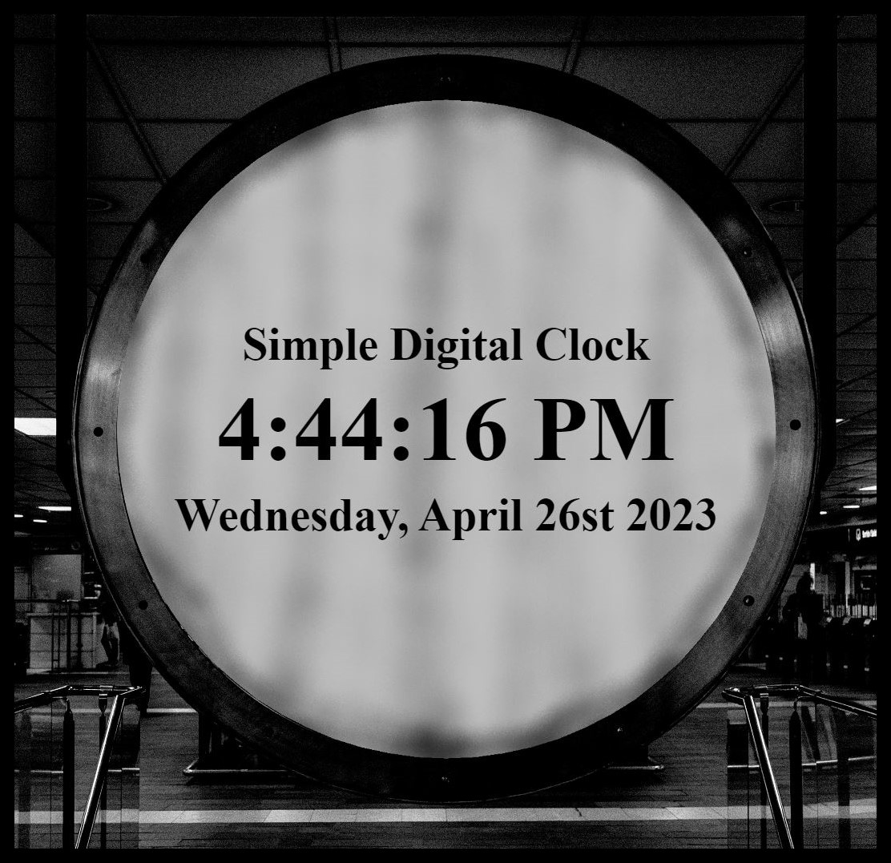

# Simple Digital Clock

A simple digital clock project that displays the current time and date using HTML, CSS, and JavaScript.

The digital clock webpage can be accessed [here](https://tkaatz.github.io/SimpleDigitalClock/).

# Screenshot

# Summary
The project features a digital clock with a clean design that displays the current time in hours, minutes, seconds, and AM/PM format, as well as the current date with the day of the week, month, date, and year. The HTML file structures the content, the CSS file applies styling to the clock, and the JavaScript file contains functions for formatting and updating the time and date display.

# Author
**Taylor Kaatz** - [Linkedin](https://www.linkedin.com/in/taylorkaatz/)
